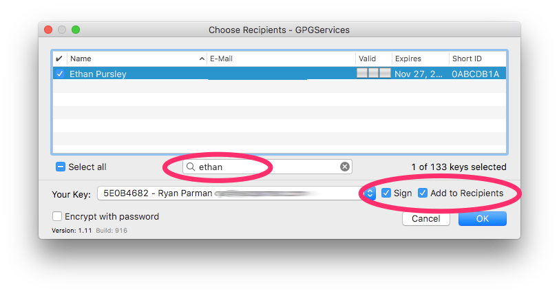

# Installing GPG Tools Suite for macOS

## Download

[GPG Tools Suite][gpgtools]

## Create a New Key

First, open the _GPG Keychain_ and choose _New_.

Next, fill out the Wizard making certain selections.

* ✓ _Upload the public key_
* Key type should be _RSA and RSA (default)_
* Length should be _4096_.
* Expiration should be any value, but the default value is _4 years from now_.

Right-click on your name, and choose _Export…_

Export your key, and save it somewhere where you can share it (e.g., Desktop, Dropbox, iCloud Drive).

* _Include your secret key_ **ONLY IF** you want to backup your secret key. **Never share this with anybody!**

* If you plan to _share your key with someone else, or otherwise make it public_, **UNCHECK the checkbox**.

## Importing a GPG Key

There are different ways to import the key. The **first** is to double-click the `.asc` file.

The **second** is to view the file with QuickLook, then choose to _Open with GPG Keychain…_

The **third** is to open the GPG Keychain, then drag one or more files into its window.

## Encrypt a file

You can right-click on a file, choose _Services_, then choose _OpenPGP: Encrypt file…_

You will see a prompt which allows you to select which user to encrypt the file for.

> **NOTE:** You will need that person's GPG Public Key to be imported first.

## Decrypt a file

If you are the authorized recipient of an encrypted file, you can do the following.

> **NOTE:** You will not be able to open an encrypted file that was not meant for you.

You can right-click on a file, choose _Services_, then choose _OpenPGP: Decrypt file…_

  [gpgtools]: https://gpgtools.org
