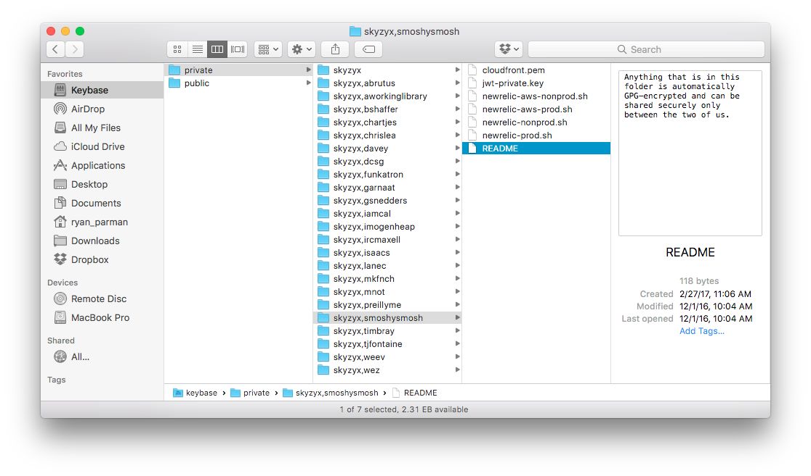

# Keybase and KBFS

[**Keybase**][keybase] makes it easy to use GPG, and makes it even easier to share encrypted files with each other using a virtual file system called [KBFS][kbfs].

## Who’s who?

Here are some sample users who are on Keybase, leveraging the ease of GPG:

| Person | Account | Description |
| ------ | ------- | ----------- |
| Ethan Pursley | https://keybase.io/smoshysmosh | Lead Web Architect at McGraw-Hill Education. |
| Ryan Parman | https://keybase.io/skyzyx | Experienced Software, DevOps, and Security Engineer. Creator of SimplePie, AWS SDK for PHP, and MFA-as-a-Service at WePay. Ambivert. Curious. Not a coffee drinker. Formerly: WePay, AWS, Yahoo! |
| Werner Vogels | https://keybase.io/werner | CTO at Amazon.com |
| Mitch Garnaat | https://keybase.io/garnaat | Creator of boto, botocore, and AWS CLI. Formerly at Amazon Web Services. |
| Chris Messina | https://keybase.io/chrismessina | Inventor the #hashtag, BarCamps and the co-working industry. Formerly at Google and Uber. |
| Mike Finch | https://keybase.io/mkfnch | Visual and interaction designer. Activist citizen. Formerly at Facebook and Amazon Web Services. |
| Coinbase | https://keybase.io/coinbase | Bringing Bitcoin to the masses. |
| Hashicorp | https://keybase.io/hashicorp | Cloud Infrastructure Automation. Consistent workflows to provision, secure, connect, and run any infrastructure for any application. |

## Share encrypted files with another user

With the Keybase client installed, you should have a new folder on your desktop.

From there, you can navigate to (or create a new folder where) your Keybase username + the other person’s Keybase username is.

> **NOTE:** You can support more than 2 people by adding more usernames separated by commas.

  [keybase]: https://keybase.io
  [kbfs]: https://keybase.io/docs/kbfs
